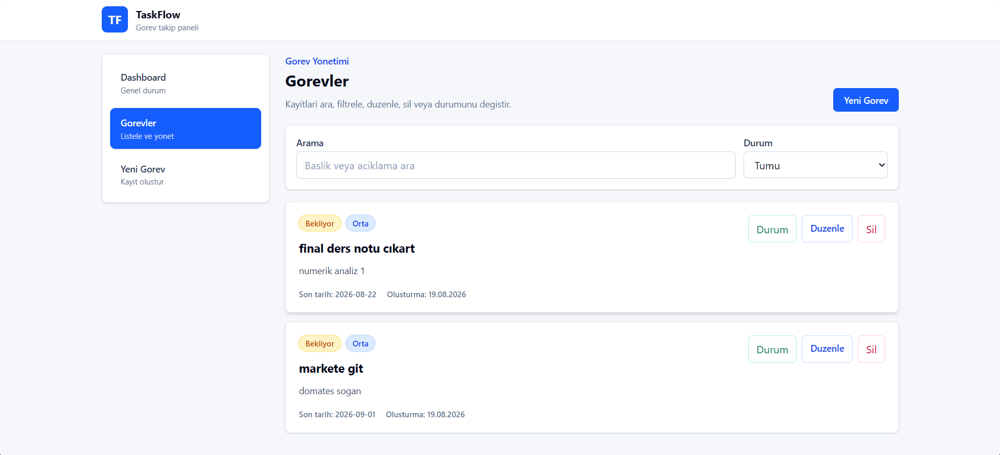

# TaskFlow

TaskFlow, React ve LocalStorage kullanilarak hazirlanmis modern bir gorev takip uygulamasidir. Proje, staj veya egitim teslimi icin CRUD islemlerini, routing yapisini ve responsive arayuzu gosterecek sekilde tasarlanmistir.

## Kullanilan Teknolojiler

- React
- Vite
- JavaScript
- Tailwind CSS
- React Router DOM
- LocalStorage

## Ozellikler

- Dashboard istatistikleri
- Gorev ekleme
- Gorev listeleme
- Gorev duzenleme
- Gorev silme
- Durum degistirme
- Arama
- Filtreleme
- LocalStorage ile kalici veri
- Bos liste ve hata durumlari
- Responsive tasarim

## Kurulum

```bash
npm install
```

## Calistirma

```bash
npm run dev
```

## Production Build

```bash
npm run build
```

## Ekran Goruntusu



## GitHub Linki

https://github.com/umutcn-code/javascript-staj-projesi

## Live Demo Linki

https://enchanting-faloodeh-4e7139.netlify.app

## GitHub'a Yukleme Adimlari

```bash
git init
git add .
git commit -m "Initial TaskFlow project"
git branch -M main
git remote add origin https://github.com/umutcn-code/javascript-staj-projesi.git
git push -u origin main
```

## Netlify Deployment

1. Netlify hesabina gir.
2. Add new site > Import an existing project sec.
3. GitHub repository baglantisini sec.
4. Build command alanina `npm run build` yaz.
5. Publish directory alanina `dist` yaz.
6. Deploy butonuna bas.

Deployment sonrasi ana sayfa, gorev listesi, yeni gorev ekleme, duzenleme, silme ve sayfa yenileme sonrasi LocalStorage kontrol edilmelidir.

## Teslim Kontrol Listesi

- [X] React projesi calisiyor
- [X] CSS framework kullaniliyor
- [X] Components klasoru var
- [X] Pages klasoru var
- [X] Interfaces klasoru var
- [X] Ekleme islemi calisiyor
- [X] Listeleme islemi calisiyor
- [X] Guncelleme islemi calisiyor
- [X] Silme islemi calisiyor
- [X] LocalStorage calisiyor
- [X] Responsive tasarim mevcut
- [X] GitHub repository public
- [X] README.md mevcut
- [X] En az bir ekran goruntusu hazir
- [X] Netlify deployment calisiyor
- [X] Live demo linki calisiyor
- [X] npm run build hatasiz calisiyor
